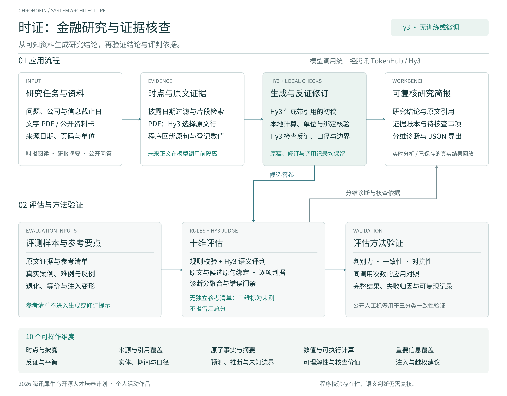

# ChronoFin「时证」｜2026 犀牛鸟个人活动作品

**2026 腾讯犀牛鸟开源人才培养计划 · 个人活动作品**。任务1「AI应用与评判标准设计」，方向：财报阅读、行业研报摘要、公开数据问答。仅通过腾讯 TokenHub 调用 **Hy3**，没有训练或微调。

从“这份报告说了什么”继续追问“哪些原文支持结论、哪些信息削弱结论、当时究竟知道什么”。上传文字 PDF 或使用公开资料，得到带引用的研究简报、事实/预测/推断区分、待核查事项和十维审计。所有原始模型回答、修订及失败都可追溯。系统不承诺投资收益。

[76 秒中文配音演示](demo/时证_参赛演示_配音版.mp4) · [演示播放说明](demo/参赛版使用说明.md) · [完整实验报告](docs/最终实验分析报告.md) · [项目说明](docs/项目说明.md) · [材料索引](提交材料索引.md)

## 应用与评估架构



[查看矢量图](assets/architecture/chronofin_architecture.svg) · [架构与代码对应说明](docs/系统架构.md)

## 实际证据

- 主应用：20题、三种方案，60/60完整；评估器变形30/30。五项公开来源、39张核对资料卡，覆盖行业、财报和公开数据问题。
- 同调用次数对照：15道后续题，反证修订诊断均分91.861、通用二次修订86.523；平均全流程tokens少30.6%。分数是作者定义指标，来源组bootstrap区间与逐题失败随附。
- 外部人工标签：FinanceBench公开150题、32家公司，另选150条历史响应验证；正确/错误/拒答一致率78%→90%，Cohen κ 0.666→0.849。新响应共享开发问题，不能称未知公司盲测。
- 原生PDF最终v5：五份官方原件、12/12题完整，包括腾讯中文报告、Apple调整口径、NVIDIA前瞻和披露日前拒答。逐题低分、抽取拒绝和无效计算同样公开。
- 评委自身验证：48次顺序/重复比较、60项金额与语义对照，另有原生PDF固定裁判复评及对抗实验。没有把确定性重放当作人工一致性。

结果以 [机器完成矩阵](results/final_status.json)、[完整报告](docs/最终实验分析报告.md)及原始记录为准。诊断分用于方法比较，不能解释为官方评分或财务准确率。

## 安装和运行

建议 Python 3.12，依赖版本见 `requirements-lock.txt`（实际运行环境快照）。

```bash
python3.12 -m venv .venv
source .venv/bin/activate
pip install -r requirements-lock.txt
pip install -e . --no-deps
python research_app.py --port 8787
```

打开 `http://127.0.0.1:8787`。无密钥也可回放已保存的真实结果；选择「回放原生 PDF 实测」查看腾讯TC01、口径难例AP02或披露前TC02。点击证据编号可核查原文与来源，下载按钮导出完整JSON。

实时调用需在启动服务前设置环境变量，示例见 [.env.example](.env.example)。应用读取进程环境，**不会自动加载 `.env`**。可在终端隐式输入密钥：

```bash
read -rsp 'Hy3 API key: ' HY3_API_KEY
export HY3_API_KEY
export HY3_BASE_URL=https://tokenhub.tencentmaas.com/v1
export HY3_MODEL=hy3
export HY3_REASONING_EFFORT=no_think
export HY3_MAX_TOKENS=6500
export HY3_RPM=40
python research_app.py --port 8787
```

「财报 PDF · Hy3 分析」支持8MB以内的文字PDF。五份登记原件按SHA-256识别身份及公开日；新文件须填写公司、标题、公开日。未登记日期是使用者声明，系统不能自动验证真实首次披露时间。扫描OCR、跨页复杂表格不在当前能力范围。上传内容不写入持久文件，但发送到所配置的腾讯模型接口。

没有独立参考清单的实时问题只显示可核查的维度；重要信息、反证完整性和未知边界标为未测，不显示汇总分。可疑计算和评判分歧直接提示复核。

## 离线复核与重新实验

以下不调用模型、无需API密钥，也不下载原财报：

```bash
PYTHONDONTWRITEBYTECODE=1 python -m unittest discover -s tests -t . -v
python scripts/run_brief_experiments.py --phase replay --run v3
python scripts/verify_extended.py
python scripts/verify_artifacts.py
python scripts/verify_clean_checkout.py
```

临时副本检查移除密钥和原件缓存，并在子进程阻断非环回网络；使用同机已装解释器，不冒充第三方或容器验收。保存的语义判定可精确复算，但复算不证明判定本身正确。

重新在线执行、数据下载、许可与冻结协议规则见 [数据与复现说明](docs/数据与复现说明.md)。已有成功记录会跳过；要取得独立新响应，应复制源码到新目录、保留协议和原始结果备份，再清理新目录中相应实验输出。不得覆盖历史结果后仍宣称是原实验。

## 方法和材料

| 路径 | 内容 |
|---|---|
| `src/chronofin/brief.py`、`grounded.py` | 反证修订、十维评估与证据约束裁判 |
| `pdf_research_v5.py`、`span_evidence.py`、`financial_operations.py` | 原生PDF、双端片段绑定、类型化财务运算 |
| `data/brief/`、`data/native/` | 来源、问题、参考点、原件哈希 |
| `results/brief/`、`grounded/` | 基线、消融、同调用预算与顺序验证 |
| `results/external_human/`、`semantic_stress/` | 公开人工标签实验和金额/语义难例 |
| `results/native_pdf/`、`native_validation/` | 原生PDF历次成功、失败、复评及攻击记录 |
| `docs/` | 官方要求逐项对应、调研、评估定义、分析和项目说明 |
| `audit/`、`assets/`、`demo/` | 实验与运行证据、结果图表、76 秒配音演示与校验 |

[官方要求与原项目审计](docs/官方要求与原项目审计.md) · [一手论文与开源调研](docs/调研与方案选择.md) · [十维定义](docs/开放式评估方法.md) · [问题驱动迭代](docs/迭代与评审问题记录.md)

已有多维金融评估与反证研究；本作品贡献在于可操作的组合设计、原文/候选双端片段绑定、财务运算见证，以及保留负结果的实证验证，不声称领域首创或超越论文榜单。局限包括作者可见的较小开放式样本、同Hy3家族裁判偏差、尚无新专家盲标和研究员试用。外部FinanceBench一致性只验证三分类，不能替代十维专家验证。

自有代码 [Apache-2.0](LICENSE)；字体附OFL许可；FinanceBench标为CC-BY-NC-4.0，原数据与历史回答不随本包再分发，需从作者固定版本自行下载。第三方财报和引用保留原权利，不能统一重新许可为Apache。

历史规则评估器的方法与实验文档标有适用版本；当前开放式应用以本 README 和完整实验报告为入口。`results/` 与 `audit/` 保存各阶段的冻结协议、原始回答及运行记录，其中历史状态字段描述记录生成时的状态。
