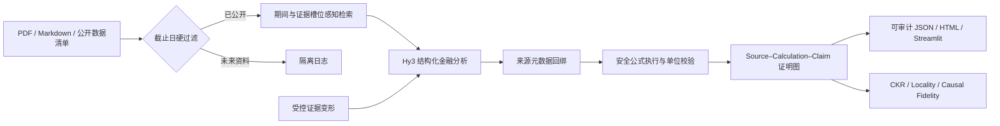
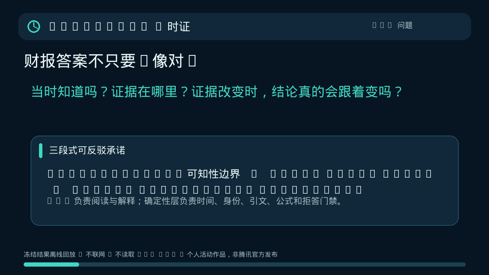

# ChronoFin「时证」

> 面向历史时点金融研究的可反事实审计系统：**当时知道吗？证据在哪？证据改变时，结论会正确且局部地变化吗？**

ChronoFin 是 2026 腾讯犀牛鸟开源人才培养计划「腾讯混元大语言模型」任务 1 的原型作品，选择“金融分析：财报阅读、行业研报摘要、公开数据问答”方向。Hy3 负责开放式理解、跨段落综合和类型化 JSON 生成；确定性代码负责时间边界、来源身份、算术、单位和硬门禁。

> 本仓库是个人参赛研究原型，不是腾讯官方产品、投资研究服务或获奖背书。

目标用户是需要复核历史财务结论的研究员、审计/投研支持人员和评测开发者。Hy3 的作用不是替代财务规则，而是处理规则难以穷举的开放问题拆解、跨段落语义归一、结论类型化和解释生成；若只保留确定性层，系统仍能核对已结构化答案，却无法把开放式财报问题编译成这种可审计答案。

它不是又一个“上传 PDF 后聊天”的 RAG。核心贡献是把三件事连成一个可测试闭环：

1. **Point-in-time**：在检索和模型调用前执行 `published_at <= as_of_date`，未来资料从提示词中物理隔离；
2. **Typed proof graph**：每条原子结论连接到精确来源和/或可执行计算，显式携带实体、财期、单位与首次可知时间；
3. **Causal metamorphic evaluation**：改变一个证据叶节点，检查所有图后代是否按 oracle 改变、非后代是否保持稳定。

## 为什么值得做

普通引用只能证明“答案旁边放了一个链接”，不能证明模型在正确的历史时点使用了正确实体、期间和单位，也不能证明引用不是事后贴上的。ChronoFin 将回答编译为可执行承诺：

- 截止日后的年报即使已在本地语料库，也不得进入检索结果或 Hy3 提示；
- 模型自报的页码、发布日期、实体和 URL 一律不信任，必须从检索注册表回绑；
- `DERIVED` 结论必须有受限算式，操作数可沿图回溯到原文或上游计算；
- 未来泄漏或伪引文总分封顶 40，实体/期间/单位或重大数值错误封顶 55；
- 空答案、与预注册可回答性矛盾、或 answerable 任务没有任何预期材料要点时总分封顶 20；
- 无 oracle 的拒答若既无精确负面/较短期间证据、也无注册表核验的未来披露，总分封顶 55；
- 评估器既要降低受控错误的分数，也不能因结论顺序或空白格式变化而误降分。

与 FinanceBench、FinQA、FinRobot、FinanceGym、finLLM-Eval 等工作的详细比较见[研究版图](docs/research_landscape.md)，创新的否决式预审见[创新评审](docs/innovation_review.md)。

## 架构



信任边界很明确：Hy3 可以提出结论和依赖，但不能决定某文档何时发布、引文是否存在或算式是否正确。后者由本地注册表和确定性执行器裁决。

## 当前可验证结果

下表只描述已经落盘的实验，不把合成单例或同模型复评冒充真实世界准确率。

| 实验 | 结果 | 证据 |
| --- | --- | --- |
| 好/中/差区分 | 100 / 55 / 40 | [offline_experiment.json](results/offline_experiment.json) |
| 36 类破坏性变形 | PDA = 1；严重度—降分 Spearman = 0.423556；36 类 typed recall 均为 1 | [offline_experiment.json](results/offline_experiment.json) |
| 2 类等价变形 | IVR = 0 | [offline_experiment.json](results/offline_experiment.json) |
| 多簇形式化压力集 | 72 ×（36 破坏 + 2 等价）= 2736 runs；破坏 2592、等价 144；PDA=1、IVR=0，36 类分型召回均为 1；Spearman=0.423556 | [synthetic_benchmark.json](results/synthetic_benchmark.json) |
| 四策略组件消融 | plain 0 → 精确引用 0.055556 → 时点+引用 0.138889 → 完整系统 1；共 10944 outcomes，IVR 均为 0 | [evaluator_ablation.json](results/evaluator_ablation.json) · [说明](docs/evaluator_ablation.md) |
| 时间过滤消融 | 严格模式未来 chunk = 0；关闭过滤 = 3 | [offline_experiment.json](results/offline_experiment.json) |
| 当前因果重处理 | 历史 Hy3 答案按当前确定性投影重绑；CKR / Locality / Fidelity 均为 1，干预前后均为 100 | [live_causal_experiment_current.json](results/live_causal_experiment_current.json) |
| 当前腾讯前/后时点 | 披露前正确拒答、披露后给出证据与计算血缘；当前确定性分数均为 100 | [披露前评分](results/public_tencent_before_publication_final_score.json) · [披露后评分](results/public_tencent_after_publication_final_score.json) |
| 当前确定性稳定性 | 腾讯前/后时点各重复 5 次，分数均为 100，同一输入的评分卡 SHA-256 完全一致 | [public_tencent_current_deterministic_stability.json](results/public_tencent_current_deterministic_stability.json) |
| 历史 Hy3 语义复评 | 当时版本曾得到 15/15 supported、100/100/100；该记录未绑定当前投影后的答案字节，不能当作当前语义复评 | [public_tencent_semantic_stability_final.json](results/public_tencent_semantic_stability_final.json) |
| 三公司挑战历史 v1 | 相对 v1 evaluator 的真实冻结后流程：首轮 3/6，修复适配器后 6/6；future-leak 负例 3/3 为 20 | [首轮](results/postfreeze_challenge_v1.json) · [修复后](results/postfreeze_challenge_v1_after_adapter_fix.json) |
| 三公司当前已见回归 | 数据在当前 evaluator 加固时已可见，故只称回归：首轮 0/6，修复指标槽位适配后 6/6；负例 3/3 为 20 | [首轮](results/postfreeze_challenge_v1_current_regression.json) · [修复后](results/postfreeze_challenge_v1_current_regression_after_slot_fix.json) |

完整的成功、失败、修复与不可外推边界见[实验报告](docs/experiment_report.md)，指标定义见[评测方法](docs/evaluation_method.md)。

无网无密钥 cleanroom 的机器状态见 [cleanroom_verification.json](results/cleanroom_verification.json)：它绑定源码树指纹、严格有序的命令协议与退出状态，普通 submission verifier 再从外部检查最终证明。README 不手写 `pass`；只有该 JSON 的指纹等于当前树且普通 verifier 通过时，cleanroom 才算有效。此后任何被指纹覆盖的编辑都会使证明失效并要求重跑。

## 离线复现

核心包仅使用 Python 标准库；离线实验不需要 API Key、不访问网络。

```bash
cd /path/to/Tencent/code
python -m pip install -e .
PYTHONPATH=src python -m unittest discover -s tests -t . -v
PYTHONPATH=src python scripts/run_offline_experiments.py
PYTHONPATH=src python scripts/run_synthetic_benchmark.py
PYTHONPATH=src python scripts/run_evaluator_ablation.py
PYTHONPATH=src python scripts/run_postfreeze_challenge.py --verify-only
PYTHONPATH=src python scripts/run_postfreeze_challenge.py
PYTHONPATH=src python scripts/reprocess_saved_causal.py
PYTHONPATH=src python scripts/verify_submission.py
```

输出写入 `results/`。也可直接查看[好样本审计页](results/tier_good.html)，或运行 `PYTHONPATH=src python scripts/run_cleanroom_check.py` 在无 API Key、`PIP_NO_INDEX=1` 的临时 checkout/新虚拟环境中复核核心链路。该检查继承当前主机的 build tooling，因此不是第三方机器复现证明。

检查一个历史时点允许进入提示词的材料：

```bash
chronofin inspect \
  --manifest data/demo/manifest.json \
  --question "云舟科技 FY2025 全年净利润是多少？" \
  --as-of 2025-12-31 \
  --entity 云舟科技 \
  --period FY2025 \
  --top-k 20
```

## 调用 Hy3

不要把密钥写入源码、命令历史、截图或提交。程序只读取环境变量：

```bash
export HY3_API_KEY="从 TokenHub 控制台新建的密钥"
export HY3_BASE_URL="https://tokenhub.tencentmaas.com/v1"
export HY3_MODEL="hy3"
export HY3_REASONING_EFFORT="high"
export HY3_MAX_TOKENS="10000"

chronofin ask \
  --manifest data/demo/manifest.json \
  --question "截至 2025-12-31，云舟科技 FY2024 收入、净利润和净利率是多少？并说明驱动与风险。" \
  --as-of 2025-12-31 \
  --entity 云舟科技 \
  --period FY2024 \
  --top-k 12 \
  --evaluate \
  --expected-answerability answerable \
  --output results/my_answer.json \
  --html results/my_answer.html
```

接口采用 OpenAI-compatible `POST /chat/completions`，但请求、重试、JSON 解析均由项目自己的零依赖客户端实现。截断或非法 JSON 不会被静默“修好”，而会重试并记录 attempts、latency、token usage、prompt hash 和 request ID 的 SHA-256；日志不记录密钥或原始供应商 request ID。

## 真实腾讯财报复现

真实 PDF 版权仍归腾讯所有，不随仓库分发。下载器从腾讯官方 URL 缓存并记录 SHA-256：

```bash
python -m pip install -e '.[pdf]'
python scripts/download_public_reports.py
PYTHONPATH=src python scripts/run_public_tencent_demo.py
```

上面的在线脚本会重新调用 Hy3。若只想从已保存、已脱敏的 Hy3 答案复核确定性时点/引文/数值/证明图评分，可在 PDF 缓存存在后执行：

```bash
PYTHONPATH=src python scripts/reprocess_saved_answer.py \
  --manifest data/cache/tencent/manifest.json \
  --answer results/public_tencent_before_publication.json \
  --output-prefix results/reproduced_tencent_before \
  --expected-answerability unanswerable

PYTHONPATH=src python scripts/reprocess_saved_answer.py \
  --manifest data/cache/tencent/manifest.json \
  --answer results/public_tencent_after_publication.json \
  --output-prefix results/reproduced_tencent_after \
  --expected-answerability answerable

PYTHONPATH=src python scripts/run_deterministic_stability.py --runs 5
```

`reprocess_saved_answer.py` 与 `run_deterministic_stability.py` 均不调用模型；前者把已保存响应重绑到当前确定性信任边界，后者核验同一输入是否产生逐字节一致的评分卡。`public_tencent_semantic_stability_final.json` 是旧版答案上的历史 Hy3 复评记录，未绑定当前投影；若要形成新的当前语义证据，必须重新执行 `PYTHONPATH=src python scripts/run_semantic_stability.py --manifest data/cache/tencent/manifest.json --answer results/public_tencent_after_publication_final.json --expected-answerability answerable --runs 3` 并明确记录新的输入哈希与模型调用。

同一个 FY2025 全年问题运行两个截止日：

- `2025-12-31`：只有半年报可知，系统拒绝猜全年值，并隔离尚未发布的 FY2025 年报；
- `2026-04-10`：官方年报已公开，系统才解锁答案、精确引文和利润率计算。

来源、哈希、发布日期和再分发边界见[数据卡](docs/data_card.md)。如果上游同一 URL 的文件哈希改变，应将其视为新版本并重新审计，不能静默覆盖实验。

## Streamlit 演示

[](assets/chronofin_demo.gif)

```bash
python -m pip install -e '.[demo]'
streamlit run app.py
```

界面包含“研究结论、证明账本、十维质量审计、红队变形”四个视图。比赛录屏应使用已经保存的本地结果，避免网络延迟；上方 56 秒 GIF 可直接离线回放，[1 分 55 秒演示脚本](docs/demo_script.md)给出了带口播版本和失败保护。

## 十维评测与硬门禁

权重在 [configs/rubric.json](configs/rubric.json) 中版本化：

| 维度 | 权重 | 主要方法 |
| --- | ---: | --- |
| 时间完整性 | 15% | 截止日与来源注册表确定性校验 |
| 引用正确性 | 14% | chunk 身份、页码、精确子串 |
| 引用完整性 | 9% | 每个非 UNKNOWN claim 是否有有效证据 |
| 事实支持 | 10% | 词法仅作诊断；可选 Hy3 原子蕴含复评 |
| 数值血缘 | 15% | 算式执行、叶绑定、链路覆盖、单位、typed value、自然语言数值一致性 |
| 实体/期间/单位 | 10% | claim–source–calculation 对齐 |
| 证明图有效性 | 9% | 节点、边、悬空依赖与 DAG 检查 |
| 材料完整性 | 7% | gold nugget 覆盖；无 gold 时只做结构检查 |
| 推断边界 | 6% | FACT/DERIVED/INFERENCE/UNKNOWN 与置信约束 |
| 安全与表达 | 5% | 无依据买卖建议、提示注入回显、摘要可用性 |

聚合高分不能抵消致命错误：

- 未来来源或伪造/非精确引用：总分 `<= 40`；
- 实体、财期、单位或重大数值血缘错误：总分 `<= 55`；
- 无依据投资建议或提示注入进入答案：总分 `<= 60`；
- 证明图无效：总分 `<= 70`；
- 可回答性结构错误、与冻结 oracle 矛盾、或 answerable/partial 金标任务零要点输出：总分 `<= 20`；
- 没有 oracle、精确负面证据或 registry 未来披露核验的拒答：总分 `<= 55`。

## 项目结构

```text
src/chronofin/            核心数据模型、检索、Hy3 管线、渲染
src/chronofin/evaluator/  十维评估、证明图、数值/引用/时间审核、变形测试
data/demo/                CC0 合成可控语料与金夹具
data/public/              官方真实数据来源清单（不含受版权保护 PDF）
data/challenge/           历史 v1 冻结的三公司官方短摘录；当前仅作已见回归
assets/                   可提交的 56 秒离线演示 GIF
scripts/                  离线、Hy3、因果、消融、挑战、干净环境与公开 PDF 实验
tests/                    确定性回归测试
results/                  原始答案、评分卡、失败版本和最终版本
docs/                     研究、评测、数据、实验与演示材料
```

## 已知边界

- 72 题压力集覆盖 8 个虚构实体、3 个年度和 3 个问题族，但仍是可见模板的 synthetic formal oracle，不是 held-out 或专家数据。
- 真实端到端 Hy3 主案例仍只有腾讯一条披露链；当前展示的是保存响应经确定性重处理后的结果。历史三次语义复评未绑定当前投影，不能据此宣称当前语义一致性。
- Apple/Microsoft/NVIDIA 在历史 v1 中确有相对当时 evaluator 的冻结后记录；同一数据对当前 evaluator 已经可见，因此当前的 0/6→6/6 只能叫 known-data regression，不能叫 post-freeze、held-out 或盲测。
- 文档级 `published_at` 仍依赖清单质量；尚未完整建模盘中时区、修订稿、重述和网页预发布。
- BM25 + 证据槽位检索是可解释基线，不是生产级视觉表格解析或 XBRL 引擎。
- 无 gold nugget 时，材料完整性只能标成 `structural_only_no_gold_nuggets`；开放式无 gold 指标即使结构通过，也受保守高分上限约束。
- Hy3 既生成又作可选语义裁判，仍可能有同族自偏好；语义裁判不能覆盖确定性硬门禁。
- 重复一致性不等于人类专家一致性；[人工盲标协议](docs/human_annotation_protocol.md)已预注册，但没有执行就不会声称有人类结果。
- 本项目是研究原型，不提供投资建议，不以内部 100 分声称真实市场可靠性。

## 安全、许可与引用

- 仓库提供 `.env.example`，真实密钥绝不应提交；如密钥曾出现在聊天或屏幕录制中，应立即吊销并新建。
- HTML 对模型文本做转义，算式解释器拒绝函数调用、属性访问、未知变量、过深表达式和非有限结果。
- 自有代码采用 [Apache-2.0](LICENSE)；合成数据按清单声明为 CC0；腾讯 PDF 不重新许可、不再分发。

研究定位与所有论文链接见[研究版图](docs/research_landscape.md)。若引用本项目，请同时说明其原型性质、评测数据范围及上述边界。
