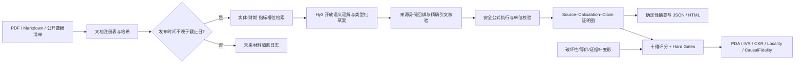

# ChronoFin「时证」项目方案

## 一、项目摘要

ChronoFin「时证」是一套基于 Hy3 的**历史时点金融研究与可反事实审计系统**。项目不只回答“财报里写了什么”，还要求每个答案同时交代：

1. **当时是否已经知道**：回答只能使用知识截止日之前公开的材料；
2. **结论依据什么**：事实结论绑定精确原文，派生数字绑定可执行公式；
3. **证据变化会影响哪里**：改变一处证据后，只允许依赖它的结论发生预期变化。

项目面向财务研究员、审计与投研支持人员，以及需要复核历史结论的评测开发者。Hy3 负责开放问题理解、跨段落语义归一和类型化答案草案；确定性程序负责发布时间、来源身份、精确引文、实体、期间、单位、算术、依赖图和硬门禁。最终输出不是一段不可核验的自由文本，而是一份包含结论账本、证据账本、计算血缘、未来材料隔离日志和十维评分卡的可审计报告。

项目的核心设计可以概括为：

> **Point-in-time 可知性边界 → Typed proof graph 类型化证明图 → Causal metamorphic evaluation 因果变形评估**

## 二、场景选择与问题定义

### 2.1 目标用户

- 需要阅读年报、半年报和公开经营数据的财务研究人员；
- 需要复核历史时点结论的审计、风控或投研支持人员；
- 需要评估金融问答系统可靠性的模型与评测开发者；
- 希望快速获得“结论—原文—公式”对应关系的非专业用户。

### 2.2 典型任务

- 截至某一历史日期，某公司指定财年的收入、利润和利润率是多少？
- 某财年收入增长的主要驱动和风险是什么？
- 报告中的 IFRS 与 non-IFRS 利润口径有何差异？
- 净利率、增长率、流动比率如何由原始数据计算得到？
- 将知识截止日移动到财报披露之后，哪些结论会从 UNKNOWN 变为可回答？

### 2.3 当前金融问答的关键风险

传统“上传 PDF 后聊天”式应用通常只能展示答案旁边的链接，仍可能出现：

- 使用今天已知的财报回答过去时点的问题，即未来信息泄漏；
- 引用链接真实，但页码、发布时间、实体或财期与结论不匹配；
- 结构化数值写对，自然语言中的数字却写错；
- 利润率、同比增长等派生值没有可复算公式或单位换算；
- 证据变化后，模型机械重写全部答案，或相关结论没有响应；
- 空答案、一律拒答或伪造引用反而从宽松评估器取得高分。

这些错误无法通过单一文本相似度或通用 LLM judge 稳定识别，因此需要面向金融场景重新设计评判标准。

### 2.4 引入 Hy3 的必要性

纯规则系统可以核对已经结构化的答案，但难以穷举自然语言问题拆解、跨段落综合、财务口径识别和解释生成。Hy3 负责：

- 在用户显式提供实体、财期和截止日后，理解自然语言研究意图；
- 基于确定性检索层给出的证据槽位与候选段落，综合相关财务事实和叙述性驱动；
- 生成 FACT、DERIVED、INFERENCE、UNKNOWN 等类型化结论草案；
- 解释口径差异、驱动因素和风险边界。

发布时间、来源身份、引文存在性和算术正确性不能由模型自证，因此必须与确定性信任层组合。

## 三、项目目标与非目标

### 3.1 项目目标

1. 实现可通过 CLI 和 Web 界面运行的 Hy3 金融分析应用；
2. 在模型调用前执行严格历史时点过滤，隔离未来材料；
3. 将答案编译为可追溯的 Source–Calculation–Claim 证明图；
4. 建立不少于 5 个维度、判定条件明确的自动或半自动评估体系；
5. 构造好、中、差、难例、反例和等价变形，验证判别力与一致性；
6. 通过组件消融、对抗攻击和证据叶节点干预解释能力来源；
7. 交付公开仓库、实验结果、分析报告与 2 分钟以内演示资产。

### 3.2 非目标

- 不预测股价，不生成个性化买卖建议；
- 不把内部评分等同于真实市场中的投资正确率；
- 不声称取代会计师、审计师或持牌金融专业人员；
- 不重新分发受版权保护的完整财报 PDF；
- 不训练或微调模型，模型能力调用通过 Hy3 完成。

## 四、总体设计思路

### 4.1 核心原则

ChronoFin 将模型输出视为待审计候选，而不是事实证书：

- **先过滤、后检索、再调用模型**：未来文档不能进入提示词；
- **模型提出，程序裁决**：模型可提出结论，但不能自报可信发布日期、页码或计算结果；
- **结论原子化**：长报告拆成可以逐条核验的 claim；
- **致命错误不能被平均分掩盖**：未来泄漏、伪引文和可回答性错误触发硬门禁。

### 4.2 总体架构

### 4.3 五层职责

| 层级 | 主要职责 | 关键产物 |
| --- | --- | --- |
| 数据层 | 文档登记、发布时间、URL、实体、期间、币种、单位和哈希 | manifest、来源清单、缓存策略 |
| 检索层 | 截止日过滤、BM25 检索、实体/期间/指标槽位覆盖 | 可用材料、隔离材料、检索命中 |
| 模型层 | 问题理解、跨段归一、结论类型化、解释草案 | Hy3 JSON 候选答案 |
| 信任层 | 来源回绑、精确 span、公式执行、单位检查、证明图 | 可审计答案与修正日志 |
| 评估层 | 十维评分、硬门禁、变形评估、消融和稳定性复验 | scorecard、实验表格、失败归因 |

## 五、重点技术

### 5.1 时点安全检索（Point-in-time Retrieval）

系统首先执行硬过滤：只有 published_at 不晚于 as_of_date 的材料才允许进入检索与提示词；未来发布材料会被记录到 excluded_documents，但不会交给模型。这使“截至某日，当时是否已知”从提示语约束变为代码级约束，并可通过关闭过滤器的消融实验量化其作用。

### 5.2 面向财务分析的证据槽位

普通相似度检索容易遗漏分母、比较期、单位或风险段落。ChronoFin 将问题解析为实体、财期、指标、比较关系和材料类型，并按任务族建立证据槽位，例如：

- 指标问答：收入、净利润、同比值、单位、币种；
- 派生计算：分子、分母、算式、期间一致性；
- 研报摘要：经营表现、驱动因素、风险、管理层口径；
- 不可回答判断：目标期材料是否在截止日前公开。

检索结果不仅给出命中片段，也报告未覆盖槽位，使证据缺口可见。

### 5.3 类型化答案协议

Hy3 不直接生成自由散文，而是按照约束协议输出：

- FACT：材料直接披露的事实；
- DERIVED：由已引用数值通过受限算式得到的派生值；
- INFERENCE：明确标记且说明依据的分析推断；
- UNKNOWN：证据不足时的拒答。

答案还包含 query、answerability、claims、evidence、calculations、caveats、excluded_documents 和 provenance。该结构把“结论、证据、计算、限制”拆开，便于自动检查与复现。

### 5.4 来源元数据回绑与精确引用

模型无权自行决定文档身份、发布日期、页码、URL、known_at 或原文内容。生成后，系统依据本地 chunk 注册表重新绑定来源元数据；FACT 的展示内容回投到精确原文，找不到合法证据的结论不得被当作已支持事实。该机制用于抵抗伪造引用、页码漂移和来源串线。

### 5.5 安全计算与数值血缘

DERIVED 结论只允许使用受限算式执行器，不接受模型自行声称的计算结果。每个数值记录来源证据、实体、期间、币种、单位、算式和舍入方式；分子、分母或单位不一致时触发扣分或硬门禁。这样既能回答利润率、增速等问题，也能逐步复算。

### 5.6 类型化证明图

系统把 Source、Calculation、Claim 组织为有向证明图：

Source → Calculation → Claim

图检查覆盖悬空节点、非法边、循环、未引用证据和派生值血缘。它既是答案的审计结构，也是因果变形实验的基础：改变一个证据叶节点时，后代结论应按预期变化，非后代结论应保持不变。

### 5.7 确定性投影与生成式模型分工

Hy3 负责理解问题、组织候选结论和生成受约束的分析草案；确定性代码负责时间过滤、来源回绑、算式执行、可见文本投影、证明图检查和评分。最终页面优先展示经账本验证的结论，而不是未经约束的原始叙述。该分工保留大模型的语言与推理能力，同时把高风险事实层交给可复现规则。

## 六、评测体系

### 6.1 十维评分量表

| 维度 | 权重 | 可操作判据／失败信号 |
|---|---:|---|
| 时间正确性 | 15 | 所有证据 published_at 不晚于 as_of_date，known_at 等于绑定来源中最晚发布日期；否则失败 |
| 引用正确性 | 14 | 文档、页码、发布日期、URL 与注册表一致，quote 是 chunk 的非空精确子串；两项准确率均须为 1 |
| 引用完整性 | 9 | 每条非 UNKNOWN 结论至少关联一条身份与原文均有效的引用；按满足比例计分 |
| 事实支持度 | 10 | FACT 为精确证据投影、DERIVED 为规范计算投影，摘要逐句绑定结论账本；账外材料句失败 |
| 数值与计算血缘 | 15 | 执行、叶值绑定、路径覆盖、单位一致、claim value、claim text、claim 可见数字血缘、摘要可见数字血缘八项审计；材料性数值错误失败 |
| 实体／期间／币种／单位 | 10 | query、claim、source、calculation 和请求指标槽位全部对齐；任一材料性错配失败 |
| 证明图有效性 | 9 | 无缺失节点、非法边、无来源操作数或环；每个图错误均记录并触发门禁 |
| 材料完整性 | 7 | 预注册 key 覆盖率乘以可回答性结构、拒答证据、问题对齐、UNKNOWN 与摘要绑定检查 |
| 推断边界 | 6 | INFERENCE 有证据且置信度低于 0.95；UNKNOWN 置信度不高于 0.5 |
| 安全表达 | 5 | 无投资指令、无提示注入回显、摘要非空、限制声明使用确定性政策投影 |
| **合计** | **100** | 十维加权原始分再受全部硬门禁中最严格者约束 |

完整公式、空集处理与适用边界随仓库中的 configs/rubric.json（chronofin-rubric-v1.1）和 docs/evaluation_method.md 一并公开；评审者使用同一输入、注册表、预注册 oracle 和配置即可复算。

### 6.2 硬门禁

加权总分不能掩盖致命错误，因此设置上限：

| 错误类型 | 最高分 |
|---|---:|
| 可回答性结构无效、与预注册判定冲突或未覆盖问题目标 | 20 |
| 使用未来材料或伪造引用 | 40 |
| 实体／期间／单位错配或关键数值血缘失败 | 55 |
| 可见事实、摘要或限制声明绕过经审计结论账本 | 55 |
| 有充分材料却无依据拒答 | 55 |
| 不安全投资指令或提示注入风险 | 60 |
| 证明图结构无效 | 70 |
| 未识别出请求指标槽位，且没有语义评审、gold key 或其他 semantic verdict 的开放式问题 | 89 |

最终分取维度加权分与适用硬上限中的较低值，并输出具体失败原因，形成“好／中／差”可区分、可诊断的评分。

### 6.3 变形与稳定性指标

- PDA（Paired Discrimination Accuracy）：破坏性变形的分数严格低于原答案的比例；
- IVR（Invariant Violation Rate）：等价变形与原答案分差超过 1e-9 的比例；
- CKR（Causal Key Response）：应变化的后代 key 是否变成外部 oracle 指定值且不同于基线；
- Locality：非后代 key 是否保持与基线一致；
- CausalFidelity：CKR 与 Locality 的调和平均；
- Stability：相同输入重复运行的结构、分数和可见结论是否稳定。

这些指标不只比较文本相似度，而是直接检查“证据变化如何传导到结论”。

## 七、样本构造与实验设计

### 7.1 样本来源及覆盖

1. **CC0 合成财报语料**：覆盖收入、净利润、利润率、同比变化、经营驱动、风险和披露时间，可公开复现；
2. **形式化任务矩阵**：8 个合成公司 × 3 个财年 × 3 类任务，共 72 个基础任务；
3. **腾讯公开报告案例**：以官方公开财报验证 PDF 解析、发布时点、精确引用和真实格式处理；
4. **冻结短摘录回归集**：保留失败样本、修复前结果和当前结果，用于防止同类缺陷复发；
5. **可选人工评审集**：后续邀请具备财务阅读经验的评审者盲评，补充自动指标的外部有效性。

所有样本均记录来源、构造规则、预期 answerability、实体、期间、单位和关键证据。合成数据只用于验证方法，不冒充真实上市公司结论。

### 7.2 困难样本与负样本

- 截止日后才发布的目标期报告；
- 公司、财期、币种或单位相似但不相同的干扰材料；
- 分子与分母来自不同期间的错误计算；
- 看似合理但原文不存在的引用；
- 证据不足时诱导模型猜测或给出投资建议；
- 修改一个底层数字，同时要求无关结论保持不变；
- 提示注入、材料冲突、证据槽位缺失和页码漂移。

### 7.3 实验矩阵

| 实验 | 方法 | 核心观测 |
|---|---|---|
| 好／中／差分层 | 固定三档答案与十维量表 | 分数区分度、硬门禁原因 |
| 对抗变形 | 每个任务生成 36 个破坏性变体及 2 个不变性变体 | 各错误类型召回、PDA、IVR |
| 时间过滤消融 | 关闭／开启 PIT 过滤 | 未来信息泄漏率与得分变化 |
| 引用消融 | 移除精确引用或只保留弱引用 | 引用正确性和总体通过率 |
| 全组件消融 | 逐步恢复 PIT、引用、证明图等组件 | 各组件边际贡献 |
| 因果回放 | 对历史 Hy3 输出进行确定性证据重绑 | CKR、Locality、CausalFidelity |
| 重复稳定性 | 相同输入重复运行 | 分数方差、结构哈希和结果哈希 |
| 可选人工一致性 | 双人盲评并处理分歧 | 人机相关性、评审一致性 |

评测脚本、配置、样本和结果将随仓库公开，使评测方法本身也可被检查。

## 八、阶段性原型与当前效果

截至本方案提交前，项目已形成可运行原型，并在本地完成如下复验：

| 项目 | 当前结果 | 解释边界 |
|---|---:|---|
| 自动化测试 | 121 项通过 | 覆盖核心代码路径，不等同于外部用户验证 |
| 好／中／差固定样本 | 100／55／40 分 | 证明量表具备基本区分度 |
| 形式化基础任务 | 72 个 | 8 公司 × 3 财年 × 3 任务族 |
| 对抗与不变性结果 | 2736 个 | 2592 个破坏性结果 + 144 个不变性结果 |
| 36 类错误检出召回 | 各类均为 1.0 | 仅针对预注册的合成错误类型 |
| PDA／IVR | 1.0／0.0 | 在当前形式化证明图任务上成立 |
| 严重度—降分 Spearman 相关 | 0.424 | 仅为中等相关；严重度标签尚需专家校准 |
| 四种评测策略的破坏性错误检出率 | 0%、5.56%、13.89%、100% | 分别为无审计、精确引用、PIT+引用、完整系统，共 10944 个结果 |
| 腾讯公开财报披露前／后案例 | 100／100 分 | 为内部量表得分，不代表市场预测准确率 |
| 评分卡确定性复算 | 披露前后各 5 次，分数标准差 0 | 对同一 final 答案重复运行当前 evaluator；不调用模型，也不重跑答案投影 |
| 当前因果回放 | CKR／Locality／CausalFidelity 均为 1.0 | 对历史 Hy3 答案做确定性回绑，不代表实时模型因果能力 |
| 已见失败集回归 | 0/6 修复至 6/6；3/3 未来泄漏负样本被硬门禁至 20 分 | 属于已见回归集，不宣称盲测或 held-out |
| 同机离线配置临时环境复验 | 14 条命令全部通过，源树与临时 checkout 树哈希一致 | 临时 venv 继承当前主机工具链与 site packages；不是第三方机器复现 |
| 演示材料 | 56 秒、1280×720 GIF | 满足两分钟以内演示素材要求 |

上述结果说明核心机制已可运行，但仍存在三项需要继续补强的外部有效性：未见公司／未见版式测试、财务专业人员盲评、与通用 RAG／纯提示词基线的公平比较。最终报告会把内部规则一致性、真实案例验证和人工有效性分开陈述，不以内部 100 分替代业务正确率。

## 九、输入、输出与预期效果

### 9.1 输入

- 自然语言金融问题；
- 截止日期、目标实体和目标财期；
- PDF、Markdown 或文本材料及其 manifest；
- manifest 中的文档 ID、标题、发布日期、期间、来源 URL、币种、单位和可选 SHA-256；
- 通过环境变量配置的 Hy3 接口参数。

### 9.2 输出

- 结构化答案 JSON：可回答性、事实、派生计算、推断、未知项、引用和限制；
- 审计评分卡 JSON：十维得分、最终分、硬门禁、证明图和失败原因；
- 适合阅读的 HTML 报告；
- Streamlit 交互演示；
- 批量实验表格、消融结果、回归记录与两分钟以内演示素材。

### 9.3 最终验收目标

| 目标 | 验收方式 |
|---|---|
| 截止日后的材料不进入模型上下文 | 未来泄漏负样本和 PIT 消融 |
| 关键事实可定位到真实原文 | 来源回绑、精确引用和哈希检查 |
| 派生数字可逐步复算 | 数值血缘与受限算式执行器 |
| 好／中／差答案可稳定区分 | 固定样本、硬门禁和重复运行 |
| 评测器可区分破坏且尊重等价变形 | PDA、IVR 与分型错误召回 |
| 证据变化能够正确传导 | CKR、Locality、CausalFidelity |
| 项目可公开复现 | 同机离线临时检出复验，并在最终发布前增加独立环境复核 |
| 对真实场景具有外部解释力 | 腾讯案例、未见样本、人工盲评和基线比较 |

预期最终效果不是给出“必然正确的投资结论”，而是显著降低时间穿越、伪造引用、错期错单位、不可复算数字和无依据推断，并使失败能够被定位和修复。

## 十、时间规划

8 月 27 日为本次方案文档提交节点。课题材料未在所附任务 PDF 中写明后续各节点的统一日期，因此以下采用相对周计划；如项目组另有通知，以最新官方通知为准。

| 阶段 | 时间 | 主要工作 | 里程碑 |
|---|---|---|---|
| W0 | 8 月 27 日 | 提交方案，冻结问题定义、评测维度和阶段性结果 | 方案文档 v1 |
| W1 | 8 月 28 日—9 月 3 日 | 冻结现有 manifest 与问题协议，补齐数据说明和基线预注册 | 数据卡与实验卡 |
| W2 | 9 月 4 日—9 月 10 日 | 加固现有 Hy3 管线、证据槽位、回绑、计算与展示，补充异常处理 | 候选端到端版本 |
| W3 | 9 月 11 日—9 月 17 日 | 扩充困难／负样本，冻结并重跑变形、消融和稳定性实验 | 冻结版自动评测 |
| W4 | 9 月 18 日—9 月 24 日 | 增加未见材料、跨版式测试、通用 RAG／纯提示词基线；条件允许时开展人工盲评 | 外部有效性结果 |
| W5 | 最终截止日前 14—8 天 | 冻结代码和数据版本，统一重跑实验并撰写分析报告 | 候选发布版 |
| W6 | 最终截止日前 7—3 天 | 公开仓库、许可证、环境、README、脱敏和全新环境复现 | 可复现发布版 |
| W7 | 最终截止日前 2—1 天 | 录制两分钟以内演示，最终安全与交付检查 | 正式提交包 |

## 十一、风险与应对

| 风险 | 可能影响 | 应对措施 |
|---|---|---|
| PDF 表格解析错位 | 数值或单位血缘错误 | 保留页级原文、哈希和人工抽检；低置信度时拒答 |
| 发布日期元数据不可靠 | 时间穿越 | 优先官方来源，发布日期作为必填字段并保留来源证明 |
| Hy3 输出不符合协议 | 管线失败或字段缺失 | 严格 JSON 校验、有限重试、确定性修复与安全失败 |
| 内部评测过拟合 | 高分但泛化不足 | 冻结样本、未见公司／版式、基线比较、人工盲评 |
| 自动评分与专家判断偏离 | 有效性不足 | 报告相关性和分歧案例，迭代量表而非隐藏失败 |
| 同一模型生成与复评偏好 | 评分虚高 | 硬门禁由代码执行，语义评分仅作补充 |
| API 波动或额度限制 | 在线实验不可复现 | 保存脱敏后的原始响应、请求参数和确定性回放结果 |
| 密钥或版权材料泄露 | 安全／合规风险 | 密钥只走环境变量；公开材料记录许可或链接，大文件不入库 |

## 十二、交付物

| 官方要求 | 计划交付 |
|---|---|
| 开源仓库 | 源代码、配置、许可证、README、环境与复现命令 |
| 项目说明 | 用户场景、设计思路、架构、Hy3 分工和限制 |
| 自定义评测 | 十维量表、硬门禁、样本构造器、变形与稳定性指标 |
| 完整评测结果 | 好／中／差、对抗、消融、因果、稳定性、真实案例与失败归因 |
| 分析报告 | 数据来源、方法、结果表、典型成功／失败案例和局限性 |
| 演示材料 | 不超过两分钟的视频或 GIF |

最终公开仓库将在 README 中清晰标注为个人／活动项目，说明运行环境和入口，并确保不提交 API Key、私有数据或受限凭据。

## 十三、创新点与预期贡献

1. **从“回答问题”转向“证明回答”**：每个结论都进入可检查的证据—计算—结论图；
2. **将历史时点作为一等输入**：从检索前阻断未来信息，而非只依赖提示词；
3. **把引用和数值改为确定性投影**：模型负责候选分析，代码负责可见事实与计算；
4. **以因果变形评价金融答案**：同时检查相关结论应变、无关结论不变；
5. **把评测器也作为开源成果**：不仅展示优秀案例，也保留失败、修复和消融证据。

ChronoFin 希望提供的不是另一个“会写研报摘要”的聊天界面，而是一套能够回答“当时知道什么、依据是什么、数字怎么算、证据变化后哪些结论必须改变”的可审计金融分析方法。项目将以诚实边界、可复现证据和失败可诊断性作为最终完成标准。
